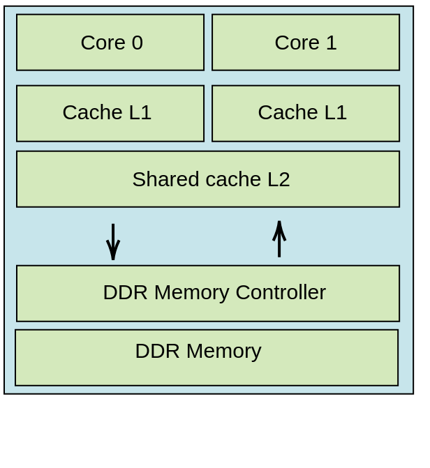

# What to observe
We want to observe relevant data that provides material for analysis of sources of interference.

We make the hypothesis that the simulator is a white box. The following will be accessible:
* The exact queue contents of the ddr is avaible for every cycle
* Acces to *miss* and *hit* information for every cycle.
* Statuses of every cache line
* Statuses of every row and bank 


## Observables:
First I choose to consider events that allow to know if there is competition between the two cores in the ddr. In the sens that two instructions from the distincts cores are waiting for scheduling stage in the main memory.
```python
 {'cycle': 20,
  'type': 'DDR_MEMORY_CONTENTION',
  'resource': 'DDR_MEMORY',
  'initiators': [0, 1],
  'details': {'banks': [0, 0],
   'rows': [0, 0],
   'operations': ['read', 'read'],
   'statuses': ['ROW HIT', 'waiting'],
   'bank_conflicts': True,
   'row_conflicts': False}},
 {'cycle': 24,
  'type': 'DDR_MEMORY_CONTENTION',
  'resource': 'DDR_MEMORY',
  'initiators': [0, 1, 1],
  'details': {'banks': [2, 0, 2],
   'rows': [0, 0, 0],
   'operations': ['read', 'read', 'read'],
   'statuses': ['ROW HIT', 'waiting', 'waiting'],
   'bank_conflicts': True,
   'row_conflicts': False}}
```
Altough we might lose information we'll associate well defined vectors to these event, in order to work with metric spaces. This will allow to measure proximity between such events:
```
associated vectors
```


We'll also work with events such as :
```
{type: hit/miss 
delay: delay,
current location:row and bank 
current command type
previous location:row and bank 
previous command type}
```


