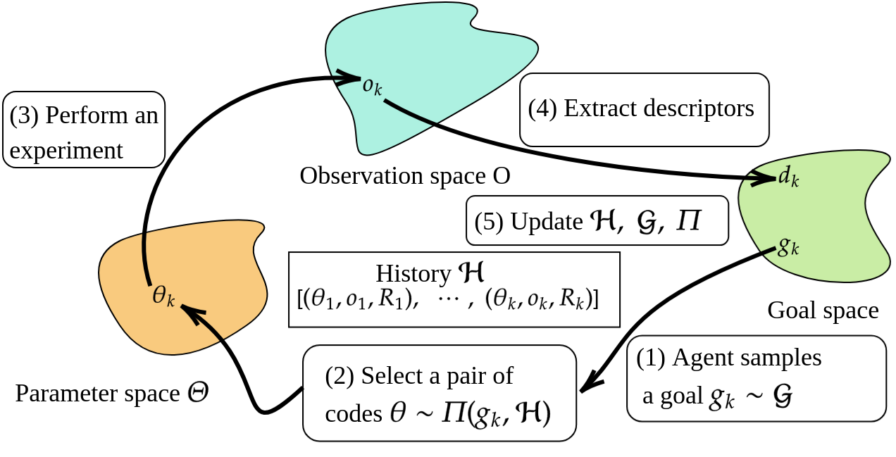

# Presentation
The purpose of the study is to developp a framework to automatically identify sources of interference on multi-core platforms:

* Identify all micro architectural mechanisms that can lead to the occurrence of an interference.
* Identify the conditions under which the corresponding interferences occur.

In order to provide a proof of concept for applying automated discovery framework on the problem of interference identification, one choose to explore a simplified simulated model of mutli-core architectures.

This will require finding sequences of code that generate a maximal diversity of interference mechanisms. The following curiosity-driven exploration method will be applied to identify hardware interference patterns. It relies on the construction of an autonomous AI agent that can learn to represent, generate, select, and solve its own problems to efficiently explore the vast outcome space of artificial or natural complex systems. These methods aim to address the knowledge gap between our ability to manipulate low-level inputs of complex systems and our on the construction of an autonomous AI agent that can learn to represent, generate, select, and solve its own

* Further work discriptions can be found in `works_description.pdf`.
# Use
* requirements: 
```
pip install -r requirements.txt
```
* Create a folder e.g `trials/new_folder`.
* Place inside a configuration file `config.json` as below:
```json
{"N":10000,
"N_init":1000,
"periode":1,
"k_values":[1,2,3],
"num_mutations":5,
"num_instructions":10,
"min_address_core0":0,
"max_address_core0":20,
"min_address_core1":21,
"max_address_core1":40,
"num_addr":41,
"max_cycle":400
}
```
* Place a script file e.g `script.sh` as below:
```python
python3 ../../test.py config.json
python3 ../../results_visualisation.py config.json
```
* execute `bash script.sh directly inside the new folder `trials/new_folder`

