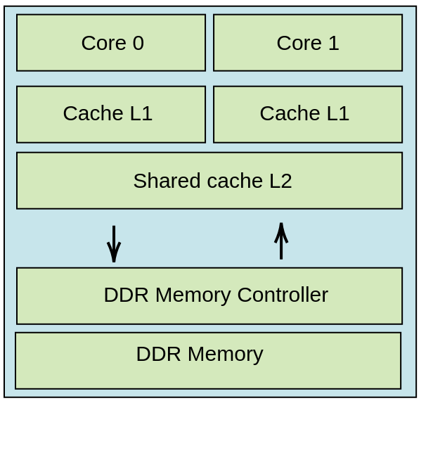
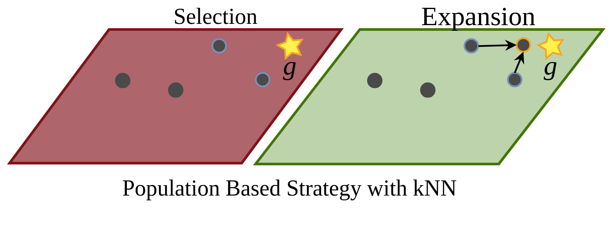
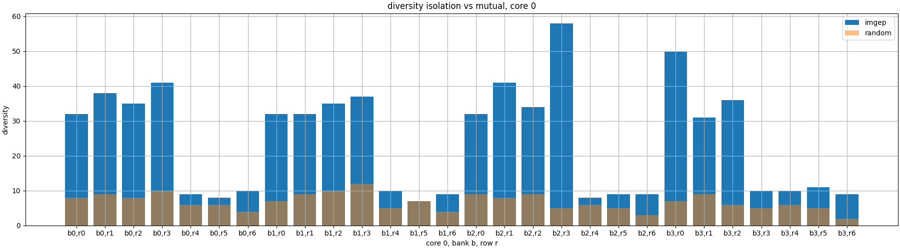
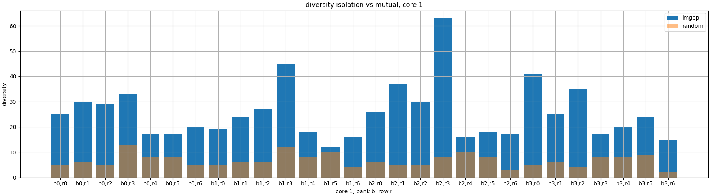
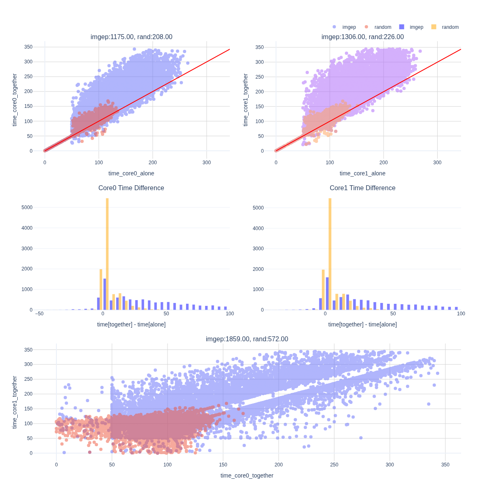
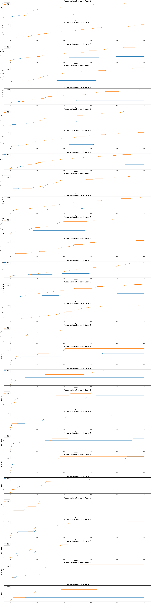

# Simulator description
A description of the simulator can be found in [Simu3](https://github.com/Ludoviccccc/Simu3)

# Some tests for the behavior of the simulator

* this following notebook gathers tests [test_simulator.ipynb](test_simulator.ipynb)
* 1 core, 2 read cycles,same index, same tag, same bank, different rows, no dependency
* 1st RD => cache miss => DDR reads transaction 
* 2nd RD => cache miss => DDR reads transaction 
```python
GlobalVar.clear_history()
# Create instruction sequences
inst0 = { 0: ('read', 0), 60: ('read', 20) }
inst1 = {  }
exp=Experiment()
exp.load_instr(inst0, inst1)
results = exp.simulate(200,display_stats=True)
import pandas as pd
print('DDR miss ratio:')
pd.DataFrame(results['miss_ratios_detailled'],columns=[f'bank {j}' for j in range(4)],index = [f'row {j}' for j in range(2)])
```
produces:
```
core0 {'level': 'L1', 'hits': 0, 'misses': 2, 'miss_rate': 1.0}
core1 {'level': 'L1', 'hits': 0, 'misses': 0, 'miss_rate': 0}
shared cache L2 {'level': 'L2', 'hits': 0, 'misses': 2, 'miss_rate': 1.0}
ddr hits [[0. 0. 0. 0.]
 [0. 0. 0. 0.]]
ddr miss [[1. 0. 0. 0.]
 [1. 0. 0. 0.]]
DDR miss ratio:
	bank 0 	bank 1 	bank 2 	bank 3
row 0 	1.0 	-0.0 	-0.0 	-0.0
row 1 	1.0 	-0.0 	-0.0 	-0.0
```

* 1 core, 2 read cycles, same cache line, no dependency
* 1st RD => cache miss => DDR reads transaction 
* 2nd RD => cache hit => no DDR transaction
```python
# Create instruction sequences
GlobalVar.clear_history()
inst0 = { 0: ('read', 0), 60: ('read', 0) }
inst1 = {}

exp=Experiment()
exp.load_instr(inst0, inst1)
results = exp.simulate(200, display_stats=True)
print('DDR miss ratio:')
pd.DataFrame(results['miss_ratios_detailled'],columns=[f'bank {j}' for j in range(4)],index = [f'row {j}' for j in range(2)])
```
output
```
--- Simulation Stats ---
core0 {'level': 'L1', 'hits': 0, 'misses': 2, 'miss_rate': 1.0}
core1 {'level': 'L1', 'hits': 0, 'misses': 0, 'miss_rate': 0}
shared cache L2 {'level': 'L2', 'hits': 0, 'misses': 2, 'miss_rate': 1.0}
ddr hits [[1. 0. 0. 0.]
 [0. 0. 0. 0.]]
ddr miss [[1. 0. 0. 0.]
 [0. 0. 0. 0.]]
DDR miss ratio:
	bank 0 	bank 1 	bank 2 	bank 3
row 0 	0.5 	-0.0 	-0.0 	-0.0
row 1 	-0.0 	-0.0 	-0.0 	-0.0
```
# Apply Intrinsically motivated Goal exploration process
## Parameter space
We use a set of 101 adresses from 0 to 100. Because it is interesting to see what interference patterns occur when running programs that don't depend on each others we divide in two parts this set for core 0 and 1.
* Core 1: addresses from 0 to 49
* Core 2: addresses from 50 to 100
  
For both core, the length of the applications will be from 1 to 10, and the 
Sequences will look like this:
```python
{4: ('write', 3),
 6: ('write', 14),
 8: ('write', 15),
 9: ('read', 7),
 16: ('write', 0),
 48: ('read', 17),
 51: ('read', 2),
 56: ('write', 2),
 60: ('write', 10)}
```
## What to observe

We want to observe relevant data that provides material for analysis of sources of interference.

We make the hypothesis that the simulator is a white box. The following will be accessible:
* The exact queue contents of the ddr is avaible for every cycle
* Acces to *miss* and *hit* information for every cycle.
* Statuses of every cache line
* Statuses of every row and bank 
## What to discover
First I choose to consider events that inform of competition between the two cores in the ddr. In the sens that two instructions from the distincts cores are waiting for scheduling stage in the main memory.
```python
{'cycle': 7,
   'type': 'DDR_MEMORY_CONTENTION',
   'resource': 'DDR_MEMORY',
   'initiators': [0, 1],
   'details': {'banks': [3, 3],
    'rows': [0, 1],
    'operations': ['read', 'read'],
    'statuses': ['ROW MISS', 'waiting'],
    'bank_conflicts': True,
    'row_conflicts': True}}

{'cycle': 35,
   'type': 'DDR_MEMORY_CONTENTION',
   'resource': 'DDR_MEMORY',
   'initiators': [1, 0, 1],
   'details': {'banks': [0, 2, 0],
    'rows': [1, 0, 0],
    'operations': ['read', 'read', 'read'],
    'statuses': ['ROW HIT', 'waiting', 'waiting'],
    'bank_conflicts': True,
    'row_conflicts': True}}
```
* Altough we might lose information we'll associate well defined vectors to these event, in order to work with metric spaces. This will allow to measure proximity between such events:
```python
 {'ratio_cores': array([0.5]),
  'count_banks': array([0., 0., 0., 1.]),#distribution among the banks
  'count_rows': array([0.5, 0.5]),#distribution among the rows
  'conflicts_bank_row': array([1, 1])})

 {'ratio_cores': array([0.667]),
  'count_banks': array([0.667, 0., 0.333, 0.]),#distribution among the banks
  'count_rows': array([0.667, 0.333]),#distribution among the rows
  'conflicts_bank_row': array([1, 1])})
```
* We can either choose L2 norm to conceive distance between vectors or use some kind of conbination, e.g use KL divergence to model distances between the distributions, and use L2/L1 norm for the rest.
* We note the characterization set of events as $\mathcal{E}=\subset\mathbb{R}^{1+\mbox{nb banks}+\mbox{nb rows} +2 }$.
We'll also work with events such as :
```
{type: hit/miss 
delay: delay,
current location:row and bank 
current command type
previous location:row and bank 
previous command type}
```
## Goal Space
### First Case 
Let:
* $\mathcal{T} = (t_{0,⋅}​(c_0​),t_{⋅,1}​(c_1​),t{0_,1}​(c_0​),t_{0,1}​(c_1​))$
* $\mathcal{M} = (ratio[0,⋅],ratio[⋅,1],ratio[0,1])$
* {L2 cache miss ratio}
  
We explore the product space: $\mathcal{G} = \mathcal{T}\times\mathcal{M}\times\{\mbox{L2 cache miss ratio}\}\subset\mathbb{R}^{1+\mbox{nb rows}\times\mbox{nb banks}\times 3+4}$
### Second Case
For more effiency we also axplore a such larger space:
We explore $\mathcal{G} = \mathcal{T}\cup\mathcal{E}$
## Goal generation
For any event we track, we synthetize a vector. Thus, we generate vectors and not events as goals
* We show that targeting multidimensional goals help to increase the diversity along on the bordure, as opposed with an exclusive exploration along the axis.
* Periodically set the sampling boundaries based on the history $\mathcal{H}$, allowing to sample new goals *e.g*:
	* $\mbox{min}_{\mathcal{T}} g:= (\mbox{min } g_1,\cdots,\mbox{min } g_6)$
 	* $\mbox{max}_{\mathcal{T}} g:= (\mbox{max } g_1,\cdots,\mbox{max } g_6)$
 * Periodically sample goal uniformly in a slightly larger set, using two factors *e.g* $f_1 = 0.8,f_2 = 1.2$, $g\sim\mathcal{U}([f_1\mbox{min } g_1,f_2\mbox{max } g_2])\otimes\cdots\otimes\mathcal{U}([f_1\mbox{min } g_6,f_2\mbox{max }g_6])$
 * During exploration we also find out that setting bounds for the time values allows more diversity, as it helps to not enlarge the data cloud in a specific direction.
See [goal_generation.py](https://github.com/Ludoviccccc/ExplorationSimu3/blob/master/exploration/imgep/goal_generator.py)

## Mixing sequence operator
In order to conserve interference patterns, we use a mixing sequence operator that randomly selects segments of the disctinct programs to produce another one. This idea comes from the fact that interference comes from specific successions of instructions tath we can call segments. If we mix randomly two applications regardless of their order, we can expect to break the interference pattern and then to not get closer from our target. See [mixxx.py](https://github.com/Ludoviccccc/ExplorationSimu3/blob/master/exploration/imgep/mixxx.py)

## Mutation Operator
With a given number of actions as argument. The program either `add`,`delete` or `modify` an instruction. The modification can either be changing the `type`,`address` or both. See [mutation.py](https://github.com/Ludoviccccc/ExplorationSimu3/blob/master/exploration/imgep/mutation.py)
## Goal achievement strategy policy $\Pi$


* The method [OptimizatoinPolicy.py](https://github.com/Ludoviccccc/ExplorationSimu3/exploration/imgep/OptimizationPolicy.py) generates a pair of instruction sequences by selecting the closest observations stored in the database $\mathcal{H}$, mixing them and lightly mutate the resulting pair.
* We synthetize a weighted to distance to avoid exploring specific regions of the total space. We start by synthetizing a weight vector with coordinates coresponding to ratios are equalled to one. Other weights for other axis will be set to the maximum value along the axis. At the end of the process with normalize the vectors so it adds up to one.
# Temporary exploration results
Run of 10000 iterations, 1000 for initialization.
* We compare k-NN goal strategy achievement IMGEP with a random exploration. Results [pictures ] show that using k-NN allows a more efficient exploration along the bordure of the domain $mathcal{O}$. Meanwhile the resulting diversity of the total space is not significantly larger.

* In order to target the right combination of parameter we perform a grid search on a product space of values of k and number of segments to split the programs. Parameters leading to the highest diversty will be selectionned.
* Parametric study with : k, number of segment for mixing operator/mixing method, exclusive exploration along axis vs non-exclusive exploration along axis
* Add diversity value: some of all squared distances
# Interpretation, diagnostics: 
* Analysis of acceleration phenomenon
* Visualisation of cache miss, ddr miss, and execution time + other space.
* Analyse the impact of exploring interference event observables.


Observation : imgep exhibe des couples de programmes dont les temps d’exécution sont bien plus importants qu’en random
pb : quels mécanismes causent les temps élevés :


H0 : imgep découvre des paires de programmes dont les adresses utilisées font overlapping + random découvre que très rarement de cas d’overlapping 

méthode 0 : pour tester: proposer méthode pour mesurer le overlap entre deux programmes, qui prend en compte que on connaît le mapping.
Prédiction : la mesure sera corrélée au temps d’exécution
on peut pas trouver en random + intéressant à trouver sur la source matérielle + est-ce qu’on voudrait éviter d’exploiter ce phénomène

 
Méthode 1 : méthode qui permet de 





## Acceleration phenomena
