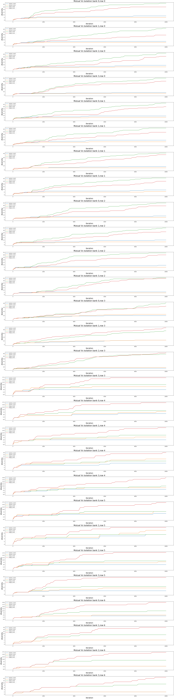

# Simulator description
A description of the simulator can be found in [Simu3](https://github.com/Ludoviccccc/Simu3)

# Some tests for the behavior of the simulator

* this following notebook gathers tests [lien](test_simulator.ipynb)
* 1 core, 2 read cycles,same index, same tag, same bank, different rows, no dependency
* 1st RD => cache miss => DDR reads transaction 
* 2nd RD => cache miss => DDR reads transaction 
```python
GlobalVar.clear_history()
# Create instruction sequences
inst0 = { 0: ('read', 0), 60: ('read', 20) }
inst1 = {  }
exp=Experiment()
exp.load_instr(inst0, inst1)
results = exp.simulate(200,display_stats=True)
import pandas as pd
print('DDR miss ratio:')
pd.DataFrame(results['miss_ratios_detailled'],columns=[f'bank {j}' for j in range(4)],index = [f'row {j}' for j in range(2)])
```
produces:
```
core0 {'level': 'L1', 'hits': 0, 'misses': 2, 'miss_rate': 1.0}
core1 {'level': 'L1', 'hits': 0, 'misses': 0, 'miss_rate': 0}
shared cache L2 {'level': 'L2', 'hits': 0, 'misses': 2, 'miss_rate': 1.0}
ddr hits [[0. 0. 0. 0.]
 [0. 0. 0. 0.]]
ddr miss [[1. 0. 0. 0.]
 [1. 0. 0. 0.]]
DDR miss ratio:
	bank 0 	bank 1 	bank 2 	bank 3
row 0 	1.0 	-0.0 	-0.0 	-0.0
row 1 	1.0 	-0.0 	-0.0 	-0.0
```

* 1 core, 2 read cycles, same cache line, no dependency
* 1st RD => cache miss => DDR reads transaction 
* 2nd RD => cache hit => no DDR transaction
```python
# Create instruction sequences
GlobalVar.clear_history()
inst0 = { 0: ('read', 0), 60: ('read', 0) }
inst1 = {}

exp=Experiment()
exp.load_instr(inst0, inst1)
results = exp.simulate(200, display_stats=True)
print('DDR miss ratio:')
pd.DataFrame(results['miss_ratios_detailled'],columns=[f'bank {j}' for j in range(4)],index = [f'row {j}' for j in range(2)])
```
output
```
--- Simulation Stats ---
core0 {'level': 'L1', 'hits': 0, 'misses': 2, 'miss_rate': 1.0}
core1 {'level': 'L1', 'hits': 0, 'misses': 0, 'miss_rate': 0}
shared cache L2 {'level': 'L2', 'hits': 0, 'misses': 2, 'miss_rate': 1.0}
ddr hits [[1. 0. 0. 0.]
 [0. 0. 0. 0.]]
ddr miss [[1. 0. 0. 0.]
 [0. 0. 0. 0.]]
DDR miss ratio:
	bank 0 	bank 1 	bank 2 	bank 3
row 0 	0.5 	-0.0 	-0.0 	-0.0
row 1 	-0.0 	-0.0 	-0.0 	-0.0
```
# Apply Intrinsically motivated Goal exploration process
## Parameter space
We use a set of 101 adresses from 0 to 100. We divide in two parts this set for core 0 and 1.
* Core 1: addresses from 0 to 49
* Core 2: addresses from 50 to 100
Sequences will look like this:
```python
{4: ('write', 3),
 6: ('write', 14),
 8: ('write', 15),
 9: ('read', 7),
 16: ('write', 0),
 18: ('read', 11),
 19: ('read', 17),
 34: ('write', 10),
 38: ('read', 6),
 39: ('write', 1),
 43: ('write', 17),
 45: ('read', 10),
 46: ('read', 10),
 48: ('read', 17),
 51: ('read', 2),
 56: ('write', 2),
 60: ('write', 10)}
```
## What to observe
We want to observe relevant data that provides material for analysis of sources of interference.

We make the hypothesis that the simulator is a white box. The following will be accessible:
* The exact queue contents of the ddr is avaible for every cycle
* Acces to *miss* and *hit* information for every cycle.
* Statuses of every cache line
* Statuses of every row and bank 
## What to discover
First I choose to consider events that inform of competition between the two cores in the ddr. In the sens that two instructions from the distincts cores are waiting for scheduling stage in the main memory.
```python
{'cycle': 7,
   'type': 'DDR_MEMORY_CONTENTION',
   'resource': 'DDR_MEMORY',
   'initiators': [0, 1],
   'details': {'banks': [3, 3],
    'rows': [0, 1],
    'operations': ['read', 'read'],
    'statuses': ['ROW MISS', 'waiting'],
    'bank_conflicts': True,
    'row_conflicts': True}}

{'cycle': 35,
   'type': 'DDR_MEMORY_CONTENTION',
   'resource': 'DDR_MEMORY',
   'initiators': [1, 0, 1],
   'details': {'banks': [0, 2, 0],
    'rows': [1, 0, 0],
    'operations': ['read', 'read', 'read'],
    'statuses': ['ROW HIT', 'waiting', 'waiting'],
    'bank_conflicts': True,
    'row_conflicts': True}}
```
* Altough we might lose information we'll associate well defined vectors to these event, in order to work with metric spaces. This will allow to measure proximity between such events:
```python
 {'ratio_cores': array([0.5]),
  'count_banks': array([0., 0., 0., 1.]),#distribution among the banks
  'count_rows': array([0.5, 0.5]),#distribution among the rows
  'conflicts_bank_row': array([1, 1])})

 {'ratio_cores': array([0.667]),
  'count_banks': array([0.667, 0., 0.333, 0.]),#distribution among the banks
  'count_rows': array([0.667, 0.333]),#distribution among the rows
  'conflicts_bank_row': array([1, 1])})
```
* We can either choose L2 norm to conceive distance between these vectors or use some kind of conbination, e.g use KL divergence to model distances between the distributions, and use L2/L1 norm for the rest.


We'll also work with events such as :
```
{type: hit/miss 
delay: delay,
current location:row and bank 
current command type
previous location:row and bank 
previous command type}
```
# Goal generation
For any event we will track we synthetize a vector. Thus, we generate vectors and not event as goals
# Temporary exploration results
Run of 10000 iterations, 1000 for initialization.



## Acceleration phenomena
